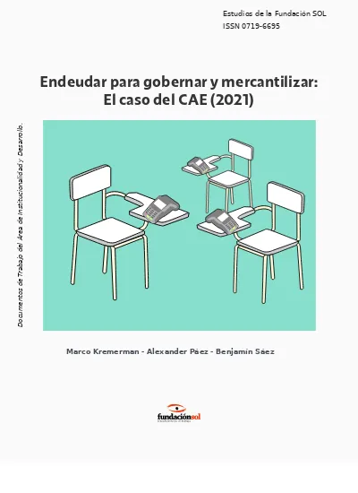
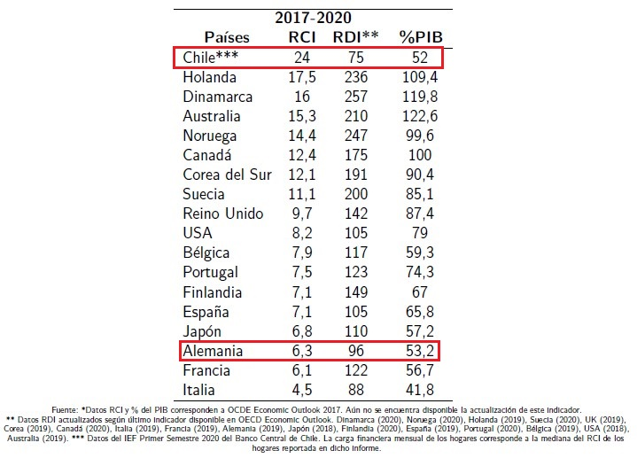

```{r xaringan-themer, include=FALSE, warning=FALSE}
library(xaringanthemer)
style_duo_accent_inverse(primary_color = "#035AA6", secondary_color = "#03A696")
```

### Sobre el documento...

--

.pull-left[

]

--

.pull-right[
"El crédito es uno de los mejores instrumentos de explotación que el hombre haya sabido establecer, porque algunos [individuos], fabricando papel, pueden apropiarse del trabajo y la riqueza de otro" 
.right[**Gabriel Ardant**]
.right[*Lazzarato, 2013:25*]

"Lo que tenemos que tener claro, es que el joven que hoy está endeudado en un tiempo empezará a preguntarse "¿y por qué yo?", cuestionará al Estado y el gobierno debe estar preparado cuando eso pase."
.right[**Sergio Bitar**]
.right[*The Clinic 12 enero 2016*]
]

---
class: center, animated

# Tesis central

--

### El acceso al **crédito** y, por lo tanto, a la deuda, funciona como un instrumento de **gobernanza** y de **mercantilización** de distintos servicios sociales básicos como educación, salud y vivienda.

--

#### En específico, el **Crédito con Aval del Estado (CAE)** desde el 2005 ha permitido profundizar la **educación de mercado** -financiando instituciones privadas de educación- y ha permitido establecer *institucionalmente* la **obligación de endeudarse**

---

### Antecedentes teóricos

--

### **Aspiracionalismo y meritocracia**

"Para el caso de Chile esto provocó un conflicto material evidente, pues los hogares para evitar la pobreza hipotecaban su fuerza de trabajo futura para obtener credenciales que les permitirían el tan anhelado ascenso social."

--

### **Expropiación financiera**

"Se permite extraer beneficios financieros para la parte acreedora, a partir de la expropiación de los salarios reales de los hogares deudores."

--

### **Economía de la deuda**

"Se establece un mecanismo de disciplinamiento para ellos y altas tasas de rentabilidad para el sector financiero."

---
class: center
### Comparación de carga financiera e ingresos disponibles



---

### Antecedentes empíricos **El caso del CAE**

--

**Subsidio a la demanda** como columna central del sistema de financiamiento de la Educación Superior.

--

### **Endeudar para Mercantilizar**

El CAE como mecanismo de financiamiento no sólo ha tenido un impacto importante en relación a los hogares, la Banca y las Instituciones de educación superior. Este crédito ha cambiado la estructura del Sistema de Educación Superior en su conjunto, de manera tal, que durante los últimos 16 años se consolidó un Sistema Privado de apéndice público.

--

### **Endeudar para Gobernar**

Se implementó un dispositivo de control social y vital sobre el presente y futuro de muchos estudiantes a través de la deuda.

---

### **Deuda y morosidad**

A diciembre de 2020 se registraban 641.288 personas pagando el CAE, ya sea desertores o egresados.

En el caso de aquellos/as estudiantes que desertaron, el 79.2% se encuentran morosos/a, mientras que el 38.8% de egresados está en la misma situación.

--

#### **Panorama territorial**

Al analizar las tasas de morosidad a nivel comunal, en territorios con elevado número de habitantes, se puede observar que existe cierta correlación entre morosidad e ingresos y pobreza. *A mayor morosidad, existe también mayor pobreza y menores ingresos*

--

#### **Aranceles de referencia y aranceles reales**

El valor del CAE otorgado se fija en relación al *Arancel de Referencia* y no al *Arancel Real* de la carrera. De esta manera se genera un pago adicional que puede llegar a ser de varios millones al año

---
class: center, middle

.pull-left[

]

.pull-right[
# **Muchas gracias por su atención!**
]


