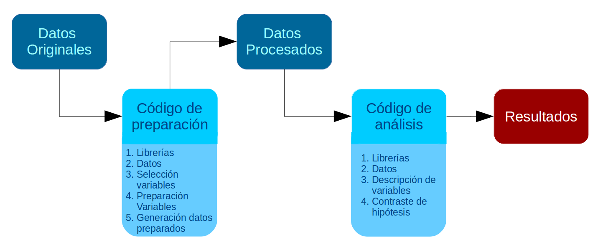

```{r xaringan-themer, include=FALSE, warning=FALSE}
library(xaringanthemer)
style_duo_accent_inverse(primary_color = "#035AA6", secondary_color = "#03A696")
```

## Estructura de la presentación

* Práctica 1: Preparación de datos

* Práctica 2: Descripción de variables

* Práctica 3: Regresión simple I

* Práctica 4: Regresión simple II

---

# Preparación de datos en R

El objetivo de esta práctica es revisar los **procedimientos básicos** para preparar datos con R. Estos procedimientos son necesarios para luego poder aplicar los contenidos específicos de este curso.

--

En general, el trabajo con datos se divide en:

1- **Preparación de datos**

2- **Análisis de datos**

--


---
# Preparación de datos en R

5 partes:

--

1. Librerías: Cargar librerías (paquetes) a utilizar

--

2. Datos: Cargar base de datos

--

3. Seleccionar variables a utilizar

--

4. Procesamiento de variables:

  a. Visualizar descriptivos básicos

  b. Recodificación: Eliminar casos perdidos y valores atípicos (de ser necesario)

  c. Etiquetamiento: etiquetar variables y valores

  d. Otros ajustes

--

5. Generar base de datos preparada para el posterior análisis


---

# Descripción de variables

El objetivo de la segunda práctica es repasar contenidos de **Estadística descriptiva** y **Estadística correlacional**

--



---

# Descripción de variables

1. Librerías: principales a utilizar en el análisis

--

2. Datos: Cargar base de datos preparada anteriormente

--

3. Descripción de variables:
  
  a. Tabla general descriptiva para la sección metodológica del trabajo
  
  b. Explorar descriptivamente la(s) relación(es) entre variables
  
--

4. Contraste de hipótesis / inferencia estadística según la técnica que corresponda

---

# Descripción de variables
```{r include=F}
pacman::p_load(dplyr, #Manipulacion de datos
              stargazer, #Tablas
              sjmisc, # Tablas
              summarytools, # Tablas
              kableExtra, #Tablas
              sjPlot, #Tablas y gráficos
              corrplot, # Correlaciones
              sessioninfo,
              texreg) # Información de la sesión de trabajo
load(url("https://multivariada.netlify.app/assignment/data/proc/ELSOC_ess_merit2016.RData")) #Cargar base de datos
```
.inverse[
```{r echo=FALSE}
sjmisc::descr(proc_elsoc,
      show = c("label","range", "mean", "sd", "n"))%>%
      kable(.,"markdown")
```
]

---
# Descripción de variables

* Variables categóricas: tabla de contingencia

* Variable categórica y continua: tabla de promedios por cada categoría

* Variables continuas: correlaciones

---
Descripción de variables: categóricas
```{r include=F}
proc_elsoc_original <-proc_elsoc
proc_elsoc <-na.omit(proc_elsoc)
proc_elsoc <-sjlabelled::copy_labels(proc_elsoc,proc_elsoc_original)
```

.inverse[
```{r echo=F}
sjt.xtab(proc_elsoc$edcine, proc_elsoc$sexo,
        show.col.prc=TRUE,
        show.summary=FALSE
)
```
]
---
# Descripción de variables: categórica y continua
.inverse[
```{r echo=F}
proc_elsoc %>% # se especifica la base de datos
  select(pmerit,edcine) %>% # se seleccionan las variables
  dplyr::group_by(Educación=sjlabelled::as_label(edcine)) %>% # se agrupan por la variable categórica y se usan sus etiquetas con as_label
  dplyr::summarise(Obs.=n(),Promedio=mean(pmerit),SD=sd(pmerit)) %>% # se agregan las operaciones a presentar en la tabla
  kable(, format = "markdown") # se genera la tabla
```
]
---
# Descripción de variables: continuas

**¿Qué es una correlación?**

--

**¿Qué valores (rango) puede tener una correlación?**

--

* El **coeficiente de correlación** mide la fuerza de la relación lineal entre dos variables continuas

* El **rango de variación** de este coeficiente va desde -1 (correlación perfectamente positiva) a 1 (Correlación perfectamente negativa)

* Positiva: A medida que aumenta una variable, también aumenta la otra

* Negativa: a medida que aumenta una variable, la otra variable disminuye

* Neutra (0): No hay asociación entre variables

Se debe analizar tanto su **tamaño** como su **significación estadística**

---
 Descripción de variables: continuas
.center[
```{r echo=F}
M <- cor(proc_elsoc)
corrplot.mixed(M)
```
]
---
 Descripción de variables: continuas
.center[
```{r echo=F}
plot_scatter(proc_elsoc, edad, ess)
```
]

---
# Regresión simple I y II

¿Residuos? ¿Parámetros? ¿Coeficientes? ¿Intercepto? ¿R2?

--

* **Intercepto**: (b0). Es el valor de Y (variable dependiente) cuando X (variable independiente) es = 0.

* **Coeficiente de regresión**: (b1). Valor que nos dice cuánto aumenta Y (variable dependiente) por cada punto que aumenta X (variable independiente). En visualización, es similar a la **pendiente** de la ecuación de la recta.

* **Residuos**: Diferencia entre el valor predicho y el valor observado

* **R2**: Representa qué porcentaje de la **Varianza de Y** podemos explicar con nuestra variable independiente **X**. Este valor varía entre 0 y 1

---
# Regresión Simple I
```{r include=F}
reg1 <- lm(pmerit~edcine, data=proc_elsoc)
```
.inverse[
```{r results='asis', echo=FALSE}
htmlreg(reg1, custom.model.names = c("Meritocracia promedio"), custom.coef.names = c("Intercepto", "Nivel educacional"))
```
]

---
class: center, middle

# Repaso prácticos 1 a 4
## **Desde preparación de datos en R hasta Regresión simple II**
## Estadística multivariada 2022
## **Universidad de Chile**
## [multivariada.netlify.app](https://multivariada.netlify.com)


