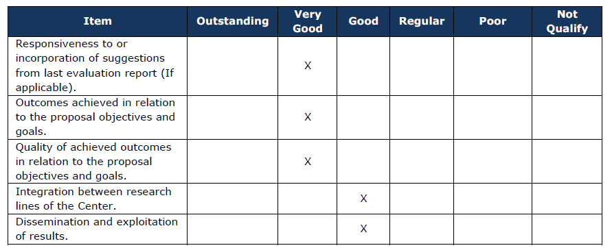
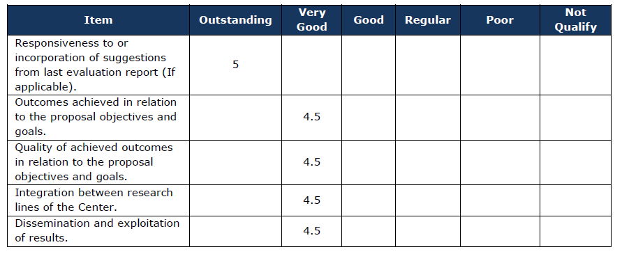

class: middle title-slide

```{r xaringanExtra, echo = FALSE}
  xaringanExtra::use_progress_bar(color = "red", location = c("top"))
```

.pull-left[


]


.pull-right[
.content-box-purple[
## Comentarios informe 2021

]

.red[
.center[

### Línea 2 - Interacciones grupales e individuales
 

COES - 21 de Noviembre 2022
]]

]
---

layout: true
class: animated, fadeIn

---

.pull-left[
<br>
<br>
<br>
Reviewer 1


]

.pull-right[
<br>
<br>
<br>
Reviewer 2


]

---
### Comentarios específicos

This research line is strongly connected with the line 3 (based on a specific focus on elite), but with weak links with line 4 and more particularly with line 1. 

In the projection part (page 29), a future collaboration on poor neighborhoods with line 4 is presenting, but no more about future collaboration with line 1.

If the elite cross-thematic agenda is well integrated, what about the gender cross-thematic agenda in this research line?

If ethnicity is analyzing around the solidarity between indigenous and non-indigenous people, I do not see specific research on people from immigrant background ?