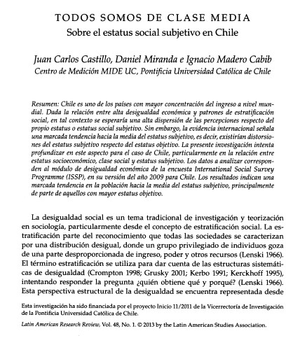
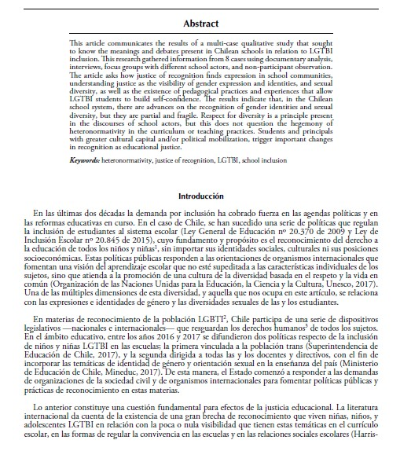
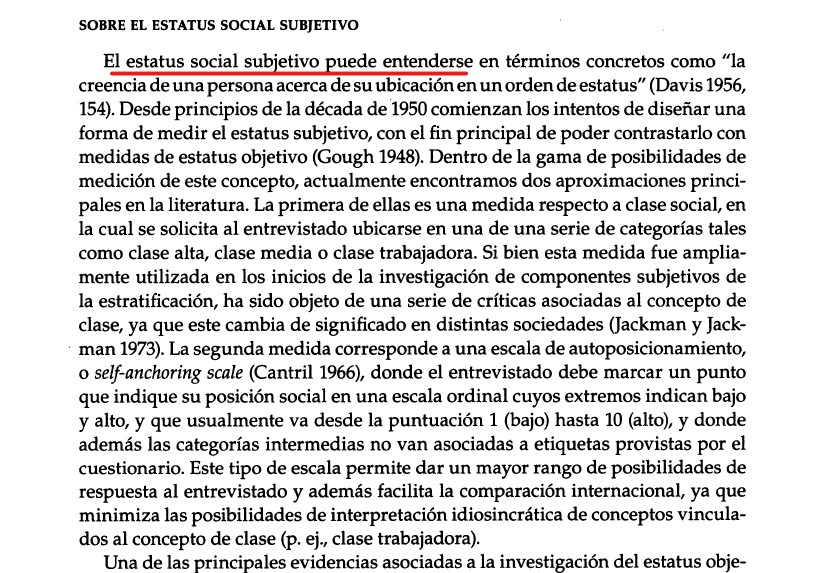
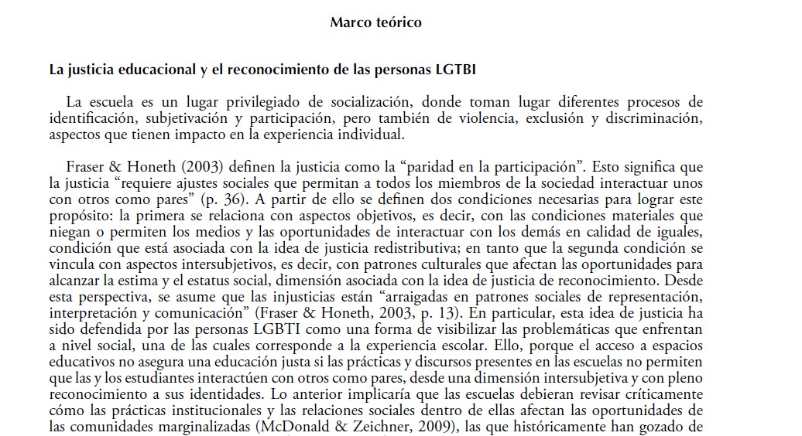
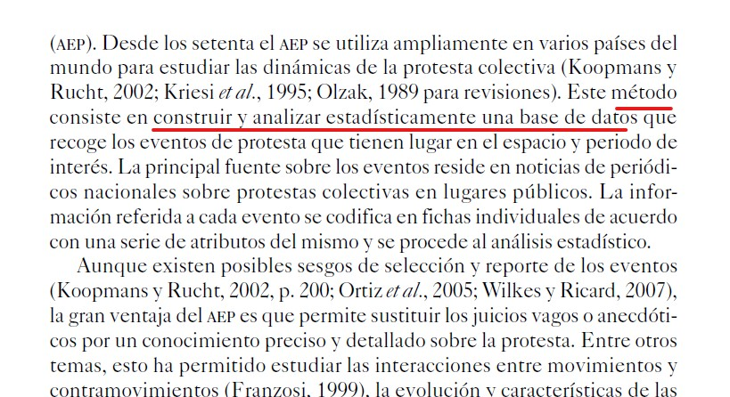
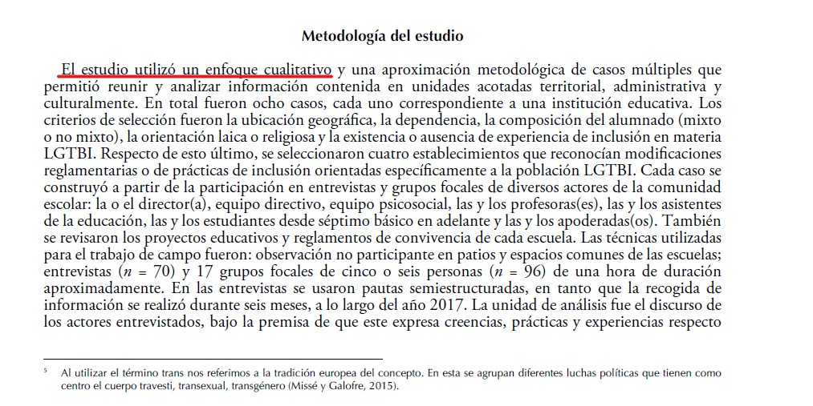
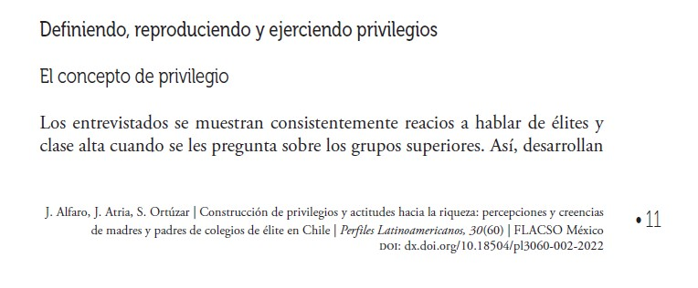
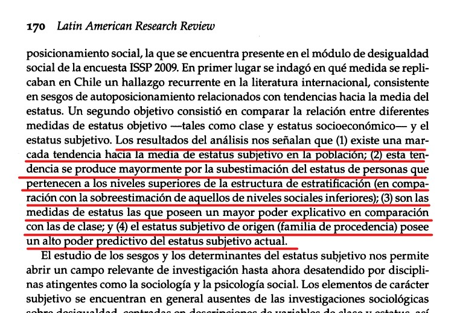

class: title-slide, middle, center

```{r xaringan-themer, include=FALSE, warning=FALSE}
library(xaringanthemer)
style_duo_accent_inverse(primary_color = "#035AA6", secondary_color = "#03A696")
```

# Diseños de Investigación

### **Taller 3**

Pablo Pérez

Kevin Carrasco

Lucas Martin

José Gálvez

.small[Jueves 1 de septiembre de 2022]

---

## ¿Introducción?

.pull-left[
.small[Castillo et. al (2013)]
.left[
]
]

.pull-right[
.small[Rojas et. al (2019)]
.right[
]
]

---
## Marco teórico

.pull-left[
.small[Castillo et. al (2013)]
.left[
]
]

.pull-right[
.small[Rojas et. al (2019)]
.right[
]
]

---

## Metodología

.pull-left[
.small[Medel & Somma (2016)]
.left[
]
]

.pull-right[
.small[Rojas et. al (2019)]
.right[
]
]
---

# Discusión y/o resultados

.pull-left[
.small[Alfaro et al (2022)]
.left[
]
]

.pull-right[
.small[Castillo et. al (2013)]
.right[
]
]

---
### Taller 3

•	El objetivo de este taller es que ustedes conozcan de dónde vienen las preguntas de investigación y que aprendan a transformar sus propias inquietudes personales en preguntas que sean investigables y cumplan con los criterios de validez que han visto en clases.

•	Para este taller hemos diseñado un ejercicio de carácter grupal donde tendrán que construir preguntas de investigación a partir de inquietudes personales relacionadas con los siguientes temas:
-	Educación
-	Género
-	Migraciones
-	Relaciones laborales

---
### Taller 3

Las instrucciones son las siguientes:

1.	En un primer momento identifiquen y conversen sobre sus inquietudes o preocupaciones personales sobre los temas propuestos.

  En sus grupos seleccionan un tema de los propuestos, y formulen preguntas en relación a este tema, de todas las formas que crean posibles, cubriendo todas las dimensiones que  les interese conocer/investigar.

2.	En internet busquen noticias, presentaciones de organizaciones o indicios del tema en el debate público.

  •	Buscaremos en redes sociales, medios de comunicaciones y páginas de organizaciones.

  •	A partir de esta búsqueda, identifiquen nuevas preguntas de investigación, distíngalas de sus inquietudes iniciales. Pueden identificar también otras preguntas relacionadas con el tema (no necesariamente deben ser todas del mismo tema inicial).

3.	Del conjunto de preguntas, seleccionen 3-6 y mejórenlas a partir de los criterios vistos en clases.

---
# Criterios de validez

1. Clara, inteligible

2. Investigable (no demasiado amplia ni abstracta)

3. No tan restringida (para llegar a ser irrelevante)

4. Si hay más de una pregunta, ellas deben estar vinculadas entre sí

5. Apuntar a lo que se quiere saber (no a cómo se puede aplicar el conocimiento)

6. Conectada de alguna manera a un debate teórico/empírico mayor

7. Con potencial de ser una contribución

---

class: middle, center

# Diseños de Investigación

### **Taller 3**

Pablo Pérez

Kevin Carrasco

Lucas Martin

José Gálvez

.small[Jueves 1 de septiembre de 2022]