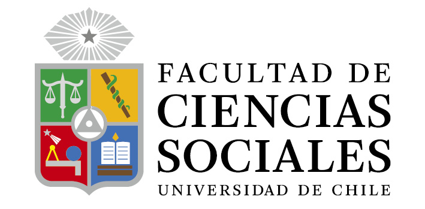

class: middle hide-logo title

```{r xaringanExtra, echo = FALSE}
  xaringanExtra::use_progress_bar(color = "red", location = c("top"))
```

.pull-left[
.espaciosimple[
.tiny[]
]
<br>
<br>
<br>


<br>

]


.pull-right[
.right[

.content-box-gray[
## Diseños de Investigación
### **Taller 3**
]

----
.espaciosimplelineas[
.medium[
Pablo Pérez

Kevin Carrasco

Lucas Martin

José Gálvez

] 
]


.small[Jueves 06 de octubre de 2022]


]
]

---
### Taller 4

•	El objetivo de este taller es que puedan mejorar sus observaciones en terreno y que aprendan cómo utilizar los resultados de su observación para mejorar la pregunta de investigación

•	Para este taller hemos diseñado un ejercicio de carácter grupal donde tendrán que sistematizar sus experiencias e incorporarlas en la pregunta hecha

---
### Instrucciones

a)	Describan su experiencia de observación al ayudante del grupo. Comenten cómo se sintieron, aspectos positivos y negativos.

b)	Después de esto hagan una ronda de comentarios, donde cada uno de los integrantes del grupo mencione sus dificultades para el trabajo. Tomen nota de ellas

c)	Identifiquen para cada una de las dificultades, posibles causas. Tomen nota de ellas

d)	Transformen estas causas en positivo (por ejemplo, si la causa fue no prestar suficiente atención a las personas observadas, en positivo sería, prestar suficiente atención a las personas observadas) y elaboren a partir de esto una lista de recomendaciones para la observación.


---
### Taller 4

a)	Lean la pregunta de investigación planteada en el taller 3 e identifiquen en ella el objeto, es decir, sobre qué fenómeno se producirá conocimiento.

b)	A partir de la ficha de observación, comparen las notas de campo entre los distintos integrantes del grupo. ¿Qué elementos comunes y divergentes hay? Tomen nota de todos ellos.

c)	Considerando los elementos identificados anteriormente, respondan la siguiente pregunta para cada uno: ¿De qué forma se relaciona este elemento con el objeto de la pregunta? ¿La acota? ¿La amplia? ¿Cambia su dirección?

d)	Incorporen estos elementos a la pregunta planteada y vuelvan a redactarla.

•	**Entreguen listado de recomendaciones y nueva pregunta a su ayudante.**
---

.pull-left[
.espaciosimple[
.tiny[]
]
<br>
<br>
<br>


<br>

]


.pull-right[
.right[

.content-box-gray[
## Diseños de Investigación
### **Taller 3**
]

----
.espaciosimplelineas[
.medium[
Pablo Pérez

Kevin Carrasco

Lucas Martin

José Gálvez

] 
]

.small[Jueves 06 de octubre de 2022]
]
]